# Meridians Infrastructure

```mermaid
flowchart TB
    subgraph UI["🖥️ UI Entry Points"]
        AnalysisPage["analysis/page.tsx<br/>(corpus upload · world-only or full)"]
        Wizard["CreationWizard<br/>(new story from premise)"]
        GenPanel["GeneratePanel<br/>(arc continuation · world expansion)"]
        AutoBar["AutoControlBar<br/>+ useAutoPlay"]
        MCTSPanel["MCTSPanel<br/>+ useMCTS"]
        BranchEval["BranchEval<br/>(review/reconstruct)"]
        StoryReader["StoryReader<br/>(prose view/rewrite)"]
        SearchView["SearchView<br/>(semantic query)"]
        MarketView["MarketView + Briefing<br/>(portfolio + suggested moves)"]
        SurveyPanel["SurveyPanel · InterviewPanel<br/>(in-character questioning)"]
        SceneGameView["SceneGameTheoryView<br/>(2x2 game decomposition)"]
        PhaseGraphView["PhaseGraphView<br/>(PRG meta-machinery)"]
        ReasoningGraphView["ReasoningGraphView<br/>(per-arc CRG)"]
        MediaDrive["MediaDrive<br/>(images · audio)"]
    end

    subgraph Core["⚙️ Core Pipelines (src/lib)"]
        TextAnalysis["text-analysis.ts<br/>chunks→entities→deltas→WBs<br/>worker pools · stage events"]
        AutoEngine["auto-engine.ts<br/>pressure→directive→arc-length"]
        MCTSEngine["mcts-engine.ts<br/>select→expand→score→backprop"]
        PacingProfile["pacing-profile.ts<br/>Markov cube-mode sampler"]
        BeatProfiles["beat-profiles.ts<br/>beat-fn Markov + voice"]
        NarrativeUtils["narrative-utils.ts<br/>F/W/S formulas + z-score"]
        PhaseGraphLib["phase-graph.ts<br/>active PRG · GC"]
    end

    subgraph AI["🤖 AI Layer (src/lib/ai)"]
        ApiTs["api.ts<br/>callGenerate · callGenerateStream"]
        Scenes["scenes.ts<br/>generateScenes · generateScenePlan<br/>extractPropositions · reverseEngineerScenePlan"]
        Prose["prose.ts<br/>generateSceneProse · rewriteSceneProse"]
        World["world.ts<br/>generateNarrative · expandWorld"]
        ReasoningGraph["reasoning-graph.ts<br/>generateReasoningGraph (CRG)<br/>generateExpansionReasoningGraph<br/>generateCoordinationPlan"]
        PhaseGraphAi["phase-graph.ts<br/>generatePhaseGraph (PRG)"]
        MarketBrief["market-brief.ts<br/>generateMarketBriefing"]
        Surveys["surveys.ts · interviews.ts<br/>research-categories.ts"]
        GameAnalysis["game-analysis.ts<br/>analyzeSceneGames"]
        Review["review.ts<br/>evaluateBranch · evaluatePlanQuality<br/>evaluateProseQuality"]
        Reconstruct["reconstruct.ts<br/>reconstructBranch (v2, v3…)<br/>editScene · insertScene · mergeScenes"]
        Search["search-synthesis.ts<br/>synthesizeSearchResults"]
        Ingest["ingest.ts · premise.ts<br/>(wizard helpers)"]
    end

    subgraph Routes["🌐 API Routes (src/app/api)"]
        GenRoute["/api/generate<br/>(SSE + JSON)"]
        EmbRoute["/api/embeddings"]
        ImgRoute["/api/generate-image"]
        CoverRoute["/api/generate-cover"]
        AudioRoute["/api/generate-audio"]
    end

    subgraph External["☁️ External Services"]
        OR["OpenRouter<br/>DeepSeek v4 Flash"]
        OAI["OpenAI<br/>text-embedding-3-small"]
        Rep["Replicate<br/>Seedream 4.5"]
        EL["ElevenLabs<br/>(audio)"]
    end

    subgraph Persist["💾 Persistence (src/lib)"]
        PersistTs["persistence.ts"]
        IDBMain[("IndexedDB · meridians-main<br/>narratives · meta · apiLogs")]
        IDBAssets[("IndexedDB · meridians-assets<br/>embeddings · audio · images")]
        LS[("localStorage<br/>activeId · prefs")]
    end

    subgraph Logging["📋 Observability"]
        ApiLogger["api-logger.ts<br/>per-call cost · tokens · preview"]
        SysLogger["system-logger.ts<br/>typed source · operation"]
    end

    %% UI → AI / pipelines
    AnalysisPage --> TextAnalysis
    Wizard --> Ingest
    Wizard --> World
    GenPanel --> Scenes
    GenPanel --> Prose
    GenPanel --> World
    GenPanel --> ReasoningGraph
    StoryReader --> Prose
    AutoBar --> AutoEngine
    MCTSPanel --> MCTSEngine
    BranchEval --> Review
    BranchEval --> Reconstruct
    SearchView --> Search
    MarketView --> MarketBrief
    SurveyPanel --> Surveys
    SceneGameView --> GameAnalysis
    PhaseGraphView --> PhaseGraphAi
    ReasoningGraphView --> ReasoningGraph
    MediaDrive --> ImgRoute
    MediaDrive --> AudioRoute

    %% Core → AI
    TextAnalysis --> ApiTs
    AutoEngine --> Scenes
    AutoEngine --> ReasoningGraph
    AutoEngine --> World
    AutoEngine --> PacingProfile
    MCTSEngine --> Scenes
    MCTSEngine --> ReasoningGraph
    MCTSEngine --> PacingProfile
    Scenes --> BeatProfiles
    Scenes --> PacingProfile
    Scenes --> Prose
    Scenes --> ReasoningGraph
    Scenes --> PhaseGraphLib
    Prose --> BeatProfiles
    Reconstruct --> Scenes
    Reconstruct --> Prose
    Ingest --> World
    PhaseGraphAi --> PhaseGraphLib

    %% AI → routes
    ApiTs --> GenRoute
    Scenes --> ApiTs
    Prose --> ApiTs
    World --> ApiTs
    ReasoningGraph --> ApiTs
    PhaseGraphAi --> ApiTs
    MarketBrief --> ApiTs
    Surveys --> ApiTs
    GameAnalysis --> ApiTs
    Review --> ApiTs
    Reconstruct --> ApiTs
    Search --> ApiTs
    Search --> EmbRoute
    Ingest --> ApiTs

    %% Routes → external
    GenRoute --> OR
    EmbRoute --> OAI
    ImgRoute --> Rep
    ImgRoute --> GenRoute
    CoverRoute --> Rep
    AudioRoute --> EL

    %% Forces derived deterministically
    TextAnalysis --> NarrativeUtils
    AutoEngine --> NarrativeUtils
    MCTSEngine --> NarrativeUtils

    %% Persistence
    TextAnalysis --> PersistTs
    AutoEngine --> PersistTs
    MCTSEngine --> PersistTs
    Reconstruct --> PersistTs
    PersistTs --> IDBMain
    PersistTs --> LS
    Search --> IDBAssets
    MediaDrive --> IDBAssets

    %% Logging cross-cuts
    ApiTs -.-> ApiLogger
    ApiLogger -.-> IDBMain
    AutoEngine -.-> SysLogger
    MCTSEngine -.-> SysLogger
    TextAnalysis -.-> SysLogger
    Review -.-> SysLogger
    World -.-> SysLogger
    ReasoningGraph -.-> SysLogger
    PhaseGraphAi -.-> SysLogger
    MarketBrief -.-> SysLogger

    classDef ui fill:#1e3a5f,stroke:#4a9eff,color:#fff
    classDef core fill:#3d2b5e,stroke:#a78bfa,color:#fff
    classDef ai fill:#5e3d2b,stroke:#fb923c,color:#fff
    classDef route fill:#2b5e3d,stroke:#4ade80,color:#fff
    classDef ext fill:#5e2b3d,stroke:#f87171,color:#fff
    classDef persist fill:#2b4a5e,stroke:#22d3ee,color:#fff
    classDef log fill:#5e5e2b,stroke:#facc15,color:#fff

    class AnalysisPage,Wizard,GenPanel,AutoBar,MCTSPanel,BranchEval,StoryReader,SearchView,MarketView,SurveyPanel,SceneGameView,PhaseGraphView,ReasoningGraphView,MediaDrive ui
    class TextAnalysis,AutoEngine,MCTSEngine,PacingProfile,BeatProfiles,NarrativeUtils,PhaseGraphLib core
    class ApiTs,Scenes,Prose,World,ReasoningGraph,PhaseGraphAi,MarketBrief,Surveys,GameAnalysis,Review,Reconstruct,Search,Ingest ai
    class GenRoute,EmbRoute,ImgRoute,CoverRoute,AudioRoute route
    class OR,OAI,Rep,EL ext
    class PersistTs,IDBMain,IDBAssets,LS persist
    class ApiLogger,SysLogger log
```

## Generation flows

The architecture supports four entry flows for creating / extending a narrative, each with a distinct cost shape:

| Flow | Trigger | Per-call shape | Notes |
|---|---|---|---|
| **Create** | `CreationWizard` | `generateNarrative` (~$0.05) + 8× plan/prose for the intro arc (~$0.34) | Bootstraps a NarrativeState from a premise. ~$0.40 once. |
| **Analyse** | `analysis/page.tsx` | Per-chunk `extractSceneStructure` + (optional `reverseEngineerScenePlan`) + `reextractFateWithLifecycle` + WB summarisation + meta-extraction | Two modes: `full` (scenes + arcs + WBs) or `world-only` (one consolidated seed commit, scenes/arcs dropped). |
| **Continue** | `GeneratePanel` / `useAutoPlay` / `useMCTS` | `generateReasoningGraph` (CRG) → `generateScenes` → 4× (`extractPropositions` + `generateScenePlan` + `generateSceneProse`) | Per-arc cost ~$0.25 generation + ~$0.05 evaluation. CRG is per-arc; PRG (`generatePhaseGraph`) is on-demand. |
| **Question** | `MarketView · Briefing` / `SurveyPanel` / `InterviewPanel` / `SceneGameTheoryView` | One LLM call per query (briefing) or N parallel calls (survey) | Operator-paced. Doesn't mutate deltas (purely observational + advisory). |

## Observability coverage

**Already instrumented** (via `logApiCall` / `logInfo` / `logError`):
- Every `/api/generate` round-trip — tokens, cost, duration, preview, per-call name
- Auto-engine cycle start, MCTS phase transitions, analysis assemble stages (`ingest` → `arcs` → `world-builds` → `world-summaries` → `meta-extraction` → `finalize`), branch eval start
- World-build summary failures, briefing generation failures, reasoning-graph generation
- Most catch blocks in AI functions

**Dark zones** (no logs → hard to debug generation quality):
1. **Decision inputs** — pacing Markov samples, beat-fn sequence, pressure-analysis outputs (stale/primed thread lists), MCTS UCB scores per selection
2. **Pipeline transitions** — phase changes in auto-engine, arc completion, coordination-plan pointer advances, world-expansion triggers
3. **Quality signals** — per-scene force snapshot, swing computation, review verdict breakdown, reconstruction outcome counts
4. **Embeddings** — when regenerated, count, which scenes dirty
5. **Asset layer** — image/audio gen success + Replicate polling state
6. **Storage** — IDB quota, narrative size, save success/failure
