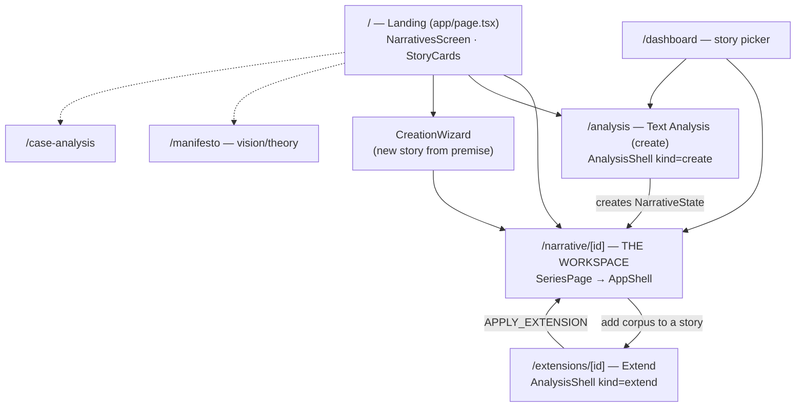
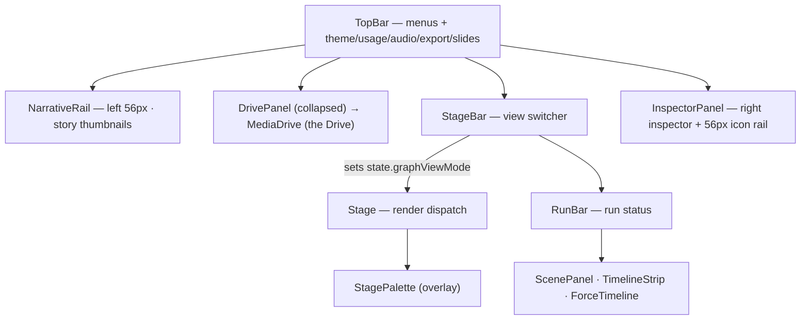
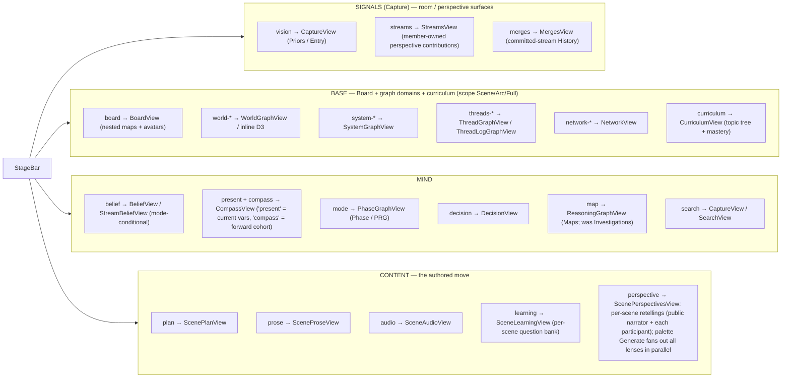
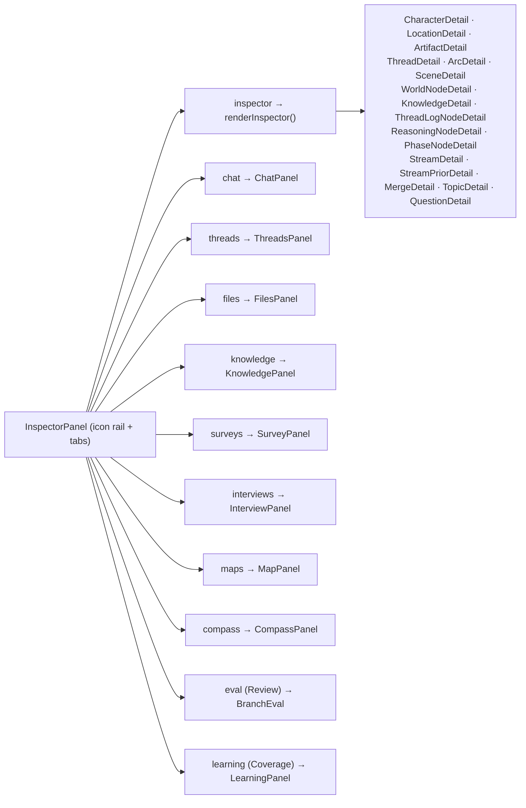
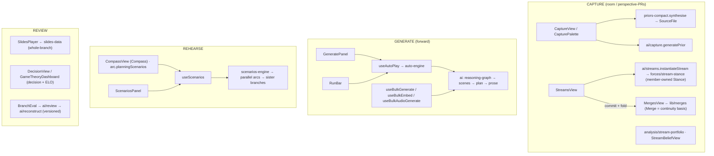
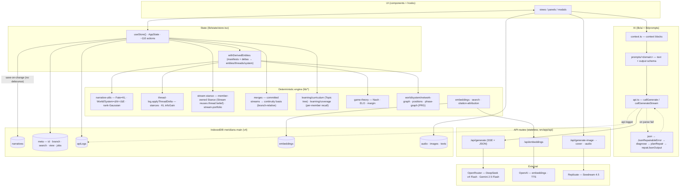
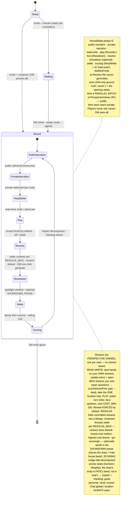

# Meridians — App Map (MERMAID)

> Top-down map of how the whole app connects, current 2026-06-09 (verified against code). Companion to [TREE.md](TREE.md) (the file structure). Read top-to-bottom: **navigation → workspace shell → center views → inspector → topbar/modals → run & output surfaces → data/AI/persistence pipeline.**

---

## 1. App navigation (pages & how you move between them)

Providers wrap every route (`app/providers.tsx`): `ThemeProvider → StoreProvider → WizardProvider → LogsProvider`; the workspace route adds `PropositionClassificationProvider → AudioPlayerProvider`. The URL `[id]` is the source of truth for the active narrative.

---

## 2. Workspace shell (regions of AppShell)

---

## 3. Center views (StageBar clusters → graphViewMode → component)

`Stage.tsx` is a render switch keyed on `state.graphViewMode`; `StageBar.tsx` groups the ~29 modes into **4 clusters: Signals · Base · Mind · Content** (tab labels; the internal cluster codenames now match — `signals` / `base` / `mind` / `content`).

> Cluster membership lives in `StageBar` (`inSignalsMode` / `inBaseMode` / `inMindMode` / `inContentMode`). The **Signals** cluster (internally Capture) is the room/perspective workspace (`vision` Priors + `streams` + `merges`); `search` moved into **Mind**. `curriculum` joins `board` + the graph domains in **Base**. *Tab labels Signals / Base / Mind / Content; the persisted `graphViewMode` literals (`vision`, `streams`, `world-*`, …) are unchanged.* `BeliefView` swaps to `StreamBeliefView` for the member-sourced stream dashboard; `RoomUI` provides shared presentation primitives (avatars, status icons, perspective names) for Streams + Merges.

Adding a view = a `GraphViewMode` literal (`types/narrative.ts`) + a `StageBar` button + a `Stage` branch (copy `mode`).

---

## 4. Right inspector (InspectorPanel tabs → bodies)

Inspector tabs are a registry inside `InspectorPanel.tsx` (separate from the center views). The `inspector` tab body is driven by `viewState.inspectorContext` via `renderInspector()`.

> New `renderInspector()` contexts: **stream** (`StreamDetail` — stance + priors log), **streamPrior** (`StreamPriorDetail` — one member-contributed prior), **merge** (`MergeDetail` — the war-room commit that folded a stream into continuity, linked to its arc), **topic** (`TopicDetail` — curriculum node rename/describe/re-parent), **question** (`QuestionDetail` — learning question + topic reassignment).

---

## 5. TopBar menus & modals

```mermaid
flowchart TB
    TB["TopBar"]
    TB --> SettingsMenu & View & Analyze & Profiles & Reference & Debug & Right

    SettingsMenu["Settings menu"] --> About["About → NarrativeEditModal"] & Members["Members → MembersModal"] & Agents["Agents → AgentsModal"]
    View["View menu"] --> Slides["SlidesPlayer"] & SlideRegions["SlideRegionsModal (scoped decks)"] & ThemeM["ThemeModal"] & TimeFlow["TimeFlowModal"]
    Analyze["Analyze menu"] --> GTD["GameTheoryDashboard"] & PropAn["PropositionAnalysisModal"] & ForceAn["ForceAnalytics"] & Markov["MarkovChainModal"]
    Profiles["Profiles menu"] --> Prose["ProseProfilePanel"] & Beat["BeatProfileModal"] & Patterns["PatternsModal"] & Settings["StorySettingsModal"]
    Reference["Reference menu"] --> Formula["FormulaModal"] & Defs["DefinitionsModal"]
    Debug["Debug menu"] --> ApiLogs["ApiLogsModal"] & SysLog["SystemLogModal"] & Embed["RegenerateEmbeddingsModal"]
    Right["Right controls"] --> Gas["GasMeter / UsageModal ($)"] & Audio["NowPlaying (audio)"] & Export["Export/Import packages"] & Learn["LearnModal (fullscreen quiz runner)"]
```

Two wiring conventions: open a local modal (`setXOpen(true)`), or `window.dispatchEvent(new Event('open-xxx'))` that the listening component handles. The **Learn** badge opens `LearnModal` directly; the scene **Learn** tab and the **Learning** inspector panel open it pre-scoped via `window.dispatchEvent('open-learn-modal', { detail: ScopeSelection })`. (`narrative/[id]/page.tsx` listens for the other `open-xxx` events when the panel lives at page level.)

> **Learning (Quiz) layer** — a purely additive, post-hoc surface (like game theory): per-scene MCQ question banks generated by `ai/learning` (`prompts/learning`) and aggregated/scoped by `lib/learning/quiz` (`ScopeSelection`). The three UI surfaces above all read the same banks stored per-scene on `scene.questions` (`LearningQuestion[]`); `LearnModal` runs scoped practice across them. A **Curriculum** layer (`lib/learning/curriculum`) organises the bank into a reorganisable `Topic` tree (questions assigned 1:1 to a topic), with `lib/learning/coverage` layering per-member spaced-repetition recall on top — the inspector **Coverage** tab and `CurriculumView` surface this.
>
> **Room / perspective model** — `NarrativeState` now carries the room: `Member[]` (exactly one GM, via **MembersModal** + `useActiveMember`), `Agent[]` (AI players with preset/custom personas — **AgentsModal**, `lib/agents/personas`), and `Perspective[]` (a seat bound to an entity or narrator, held by members and/or an agent). Each perspective accumulates **Streams** — a member's bearing on an open question — and committed streams fold into **Merges** that extend continuity. See Section 6.

---

## 6. Run & output surfaces (capture / generate / rehearse / review)

> Build status: the **room / participant model** (`Member`/`Agent`/`Perspective`), **capture-as-perspective-PRs** (Streams — a member's bearing on an open question, member-owned Stance), and the **war-room merge** (Merges fold committed streams into continuity) are now **shipped**. Still **not yet built**: the weekly market, the **Conviction** card game ([CONCEPT.md](CONCEPT.md)), local encryption/PIN, **Signal** async capture (E2E), and **Cloudflare-tunnel** (`cloudflared`) multi-user live access. Other shipped bases: `useScenarios`/`scenarios-engine` (Rehearse), `SlidesPlayer`/`slides-data` + **SlideRegionsModal** (scoped decks), `ai/review`+`reconstruct` (the engine's branch review). *Review-as-a-loop-phase and Butterfly were dropped.*

---

## 7. Data · AI · persistence · external (the engine pipeline)

**Invariants:** one source of truth (the GM's machine); forces are *derived from deltas*, never authored; derived entities re-derive from manifests (don't mutate the caches); every LLM call funnels through `ai/api.ts` and is logged by `caller`; output schemas live with the prompt builder and are shared with repair.

> **Room / curriculum state on `NarrativeState`:** `Member[]` (one GM), `Agent[]` (AI players + personas), `Perspective[]` (entity/narrator seats), `Stream[]` (member-owned bearings on open questions — a Stream reuses Fate-Thread belief mechanics but over one member-owned Stance whose log nodes are its `priors`), `Merge[]` (committed-stream folds; **Streams + Merges are branch-OWNED** — `branchId` is ownership, and a **fork deep-copies** the parent branch's streams + merges into the child with fresh ids + an `originStreamId` / `originMergeId` back-link, so every branch is a fully isolated sandbox: priors, commits, reverts and undos on one branch never touch another, and the origin links let you compare *the same question* across divergent playthroughs. Scenes stay structurally **shared** (immutable); only the mutable belief layer is copied. `n.streams` / `n.merges` remain global dicts so id-lookups always resolve; `branchId` governs which copy a branch *operates on* and *displays*. Consumption (`basisMergeIds`) matches a copy by id **or** its origin), and `Topic[]` + `LearningProgress` (curriculum tree + per-member spaced-repetition coverage). Threads = the world view's belief over narrative questions; Streams = the parallel, perspective-scoped belief layer feeding the room.

---

## 8. Conviction — the rehearsal game state machine ([CONCEPT.md](CONCEPT.md))

A game is a **branch**; a `GameRoom` runs the round loop over it as a phase machine (`RoundState.phase`), in one of two **variants** — **Rounds** (poker turn order; the diagram below) or **Showdown** (a real-time, simultaneous **LIVE** window replacing READ-WRITE + PLAY). Humans take their turns by hand; agents resolve automatically; a timeout with nothing committed = no action (ceded to the LLM). Scoring is **intrinsic**: in the **SCORING** phase each round, the realized stance shift on every thread is decomposed across the seats that moved it — **Aumann–Shapley on the Fate/KL, conserving exactly** — into a running **Impact** score, shown with a **Ranking**. **Streams are perspective-owned** (one per seat — no shared "board" streams); the **Merge** is the only place separate seats' streams meet, settling each **contested thread** per **`RESOLVE_BIAS`** (a random draw from the conviction-shaped odds by default · `lowest-cost` realism · `highest-cost` drama · `gm` sovereign), optionally spotlit in an **optional SHOWDOWN phase** before SETTLE. **Goals** are optional personal trackers that never affect the score; the old betting layer is gone. Conviction is a **gamified automation layer over the shipping stream / merge / generate UI** — one continuous window; the GM advances each round with **one click through the Generate Panel** (override optional). **Not yet built** — this is the spec.

> **Build components.**
> **Host surfaces** — (1) **GM board · desktop**: the Play fullscreen modal, global state + `act-as-seat` proxy, runs the machine. (2) **Player controller · mobile**: perspective-gated, over the tunnel.
> **Shared play UI** — minimalist; **The Board is the single primary surface** (rendered global for the GM, perspective-gated for a player — **responsive across desktop + mobile**). (3) **The Board**: poker-table-inspired felt that **conveys narration + round info directly** (no side panels) — seats as **avatar + name + conviction stack**, a rotating **dealer button**, the **live canonical threads + pot + timer** at centre (each seat's own streams sit in its hand), face-up/down reveal, plus the live **Impact tally / Ranking** and the SCORING-phase **readout** (authored stance ribbons + per-seat fate decomposition). (4) **The Cards**: the hand at the player's seat — face-up/down, `−log p` cost, play / raise / pass / fold. (5) **Chat — modal**: **global** (everyone; cheap talk) + **location** (co-located only; alliances), opened over the board; **agents are full participants**. (6) **Navigation — popups**: move, pose-question / request-more, **set / reassign goal**, settings — popups layered on the board, not panels.
> **Content tab** — (7) **Perspective views**: per-scene `PerspectiveView` (canon global + private per-entity retellings) that feed the narration phases.
> **Spec** — (8) **State machine** (this diagram): `RoundState.phase` over a `GameRoom`.
> New types (`GameRoom` (carries `variant`) · `Seat` (carries `goals` + running `fateImpact`) · `RoundState` (phase incl. `scoring`) · `Card`/`Hand`/`PlayedCard` · `CardRequest` (backs nav (6)) · `ChatMessage` · `PerspectiveView` (canon/public/private — one type for narration *and* requested retellings) · `Goal` (personal target; never scored) · `ConvictionEconomy`) layer over shipped `Perspective` / `Stream` / `Merge` / `Location` — see [CONCEPT.md](CONCEPT.md). Scoring reuses the engine's **Fate/KL + thread log** (Aumann–Shapley attribution), and the **Influence alluvial** (Fate tab) carries cumulative Impact.
