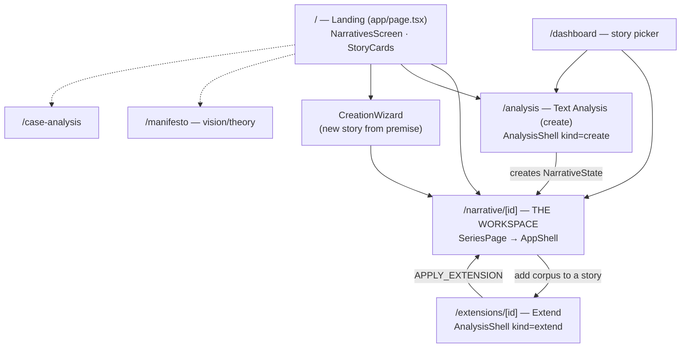
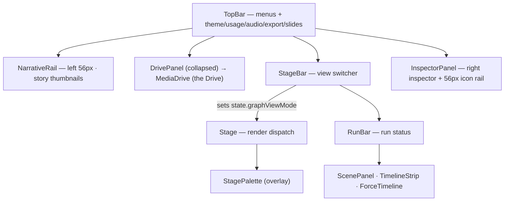
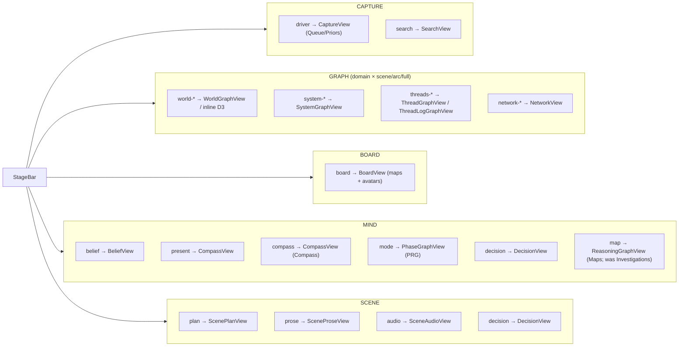
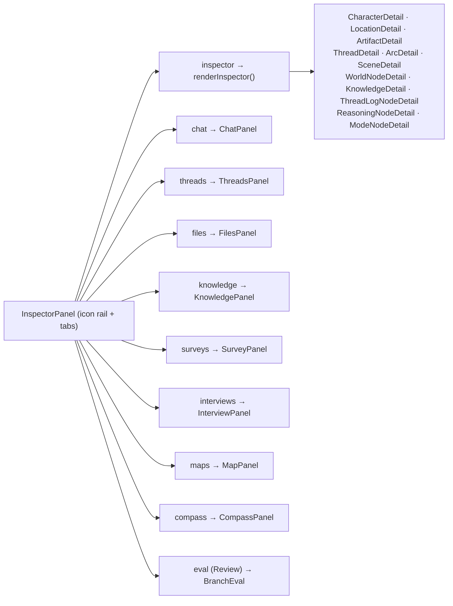
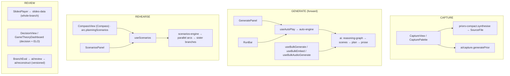
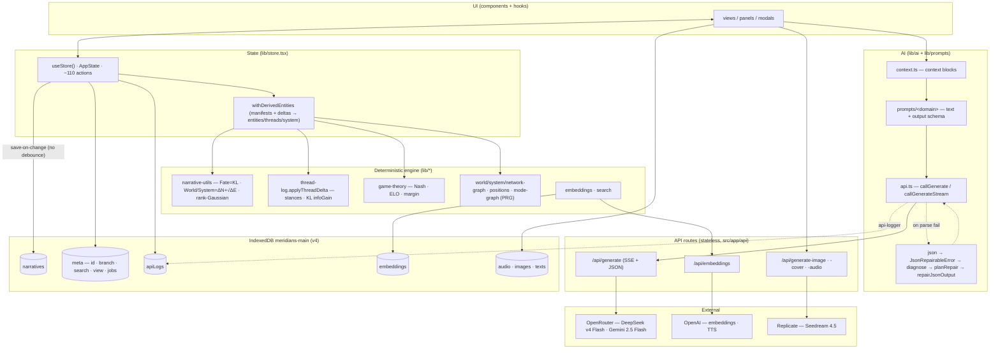

# Meridians — App Map (MERMAID)

> Top-down map of how the whole app connects, current 2026-06-04 (verified against code). Companion to [TREE.md](TREE.md) (the file structure). Read top-to-bottom: **navigation → workspace shell → center views → inspector → topbar/modals → run & output surfaces → data/AI/persistence pipeline.**

---

## 1. App navigation (pages & how you move between them)

Providers wrap every route (`app/providers.tsx`): `ThemeProvider → StoreProvider → WizardProvider → LogsProvider`; the workspace route adds `PropositionClassificationProvider → AudioPlayerProvider`. The URL `[id]` is the source of truth for the active narrative.

---

## 2. Workspace shell (regions of AppShell)

---

## 3. Center views (StageBar clusters → graphViewMode → component)

`Stage.tsx` is a render switch keyed on `state.graphViewMode`; `StageBar.tsx` groups modes into 5 clusters.

Adding a view = a `GraphViewMode` literal (`types/narrative.ts`) + a `StageBar` button + a `Stage` branch (copy `mode`).

---

## 4. Right inspector (InspectorPanel tabs → bodies)

Inspector tabs are a registry inside `InspectorPanel.tsx` (separate from the center views). The `inspector` tab body is driven by `viewState.inspectorContext` via `renderInspector()`.

---

## 5. TopBar menus & modals

```mermaid
flowchart TB
    TB["TopBar"]
    TB --> View & Analyze & Profiles & Reference & Debug & Right

    View["View menu"] --> Slides["SlidesPlayer"] & ThemeM["ThemeModal"] & TimeFlow["TimeFlowModal"]
    Analyze["Analyze menu"] --> GTD["GameTheoryDashboard"] & PropAn["PropositionAnalysisModal"] & ForceAn["ForceAnalytics"] & Markov["MarkovChainModal"]
    Profiles["Profiles menu"] --> Prose["ProseProfilePanel"] & Beat["BeatProfileModal"] & Patterns["PatternsModal"] & Settings["StorySettingsModal"]
    Reference["Reference menu"] --> Formula["FormulaModal"] & Defs["DefinitionsModal"]
    Debug["Debug menu"] --> ApiLogs["ApiLogsModal"] & SysLog["SystemLogModal"] & Embed["RegenerateEmbeddingsModal"]
    Right["Right controls"] --> Gas["GasMeter / UsageModal ($)"] & Audio["NowPlaying (audio)"] & Export["Export/Import packages"]
```

Two wiring conventions: open a local modal (`setXOpen(true)`), or `window.dispatchEvent(new Event('open-xxx'))` that `narrative/[id]/page.tsx` listens for (when the panel lives at page level).

---

## 6. Run & output surfaces (capture / generate / rehearse / review)

> Roadmap note: **per-perspective seats (A1)**, **Butterfly (A6)**, deck scoping (A7), encryption/PIN (A8), and ngrok/multi-user (B1) are **not yet built**. Rehearse (`useScenarios`/`scenarios-engine`) and the deck (`SlidesPlayer`/`slides-data`) are the shipped bases. See [ROADMAP.md](ROADMAP.md).

---

## 7. Data · AI · persistence · external (the engine pipeline)

**Invariants:** one source of truth (the GM's machine); forces are *derived from deltas*, never authored; derived entities re-derive from manifests (don't mutate the caches); every LLM call funnels through `ai/api.ts` and is logged by `caller`; output schemas live with the prompt builder and are shared with repair.
