# Meridians — App Map (MERMAID)

> Top-down map of how the whole app connects, current 2026-06-09 (verified against code). Companion to [TREE.md](TREE.md) (the file structure). Read top-to-bottom: **navigation → workspace shell → center views → inspector → topbar/modals → run & output surfaces → data/AI/persistence pipeline.**

---

## 1. App navigation (pages & how you move between them)

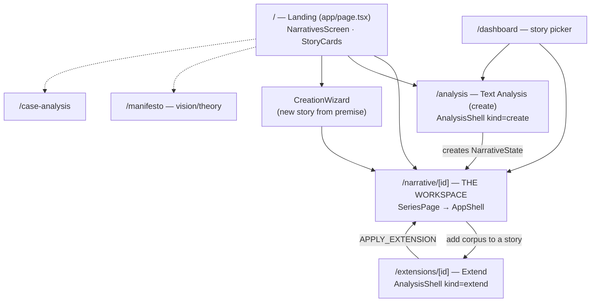

Providers wrap every route (`app/providers.tsx`): `ThemeProvider → StoreProvider → WizardProvider → LogsProvider`; the workspace route adds `PropositionClassificationProvider → AudioPlayerProvider`. The URL `[id]` is the source of truth for the active narrative.

---

## 2. Workspace shell (regions of AppShell)

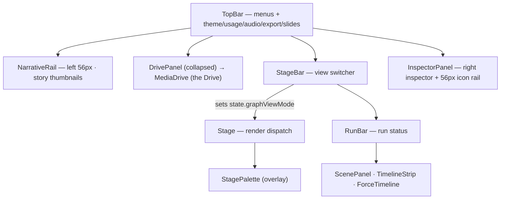

---

## 3. Center views (StageBar clusters → graphViewMode → component)

`Stage.tsx` is a render switch keyed on `state.graphViewMode`; `StageBar.tsx` groups the ~29 modes into **4 clusters: Signals · Base · Mind · Content** (tab labels; the internal cluster codenames now match — `signals` / `base` / `mind` / `content`).

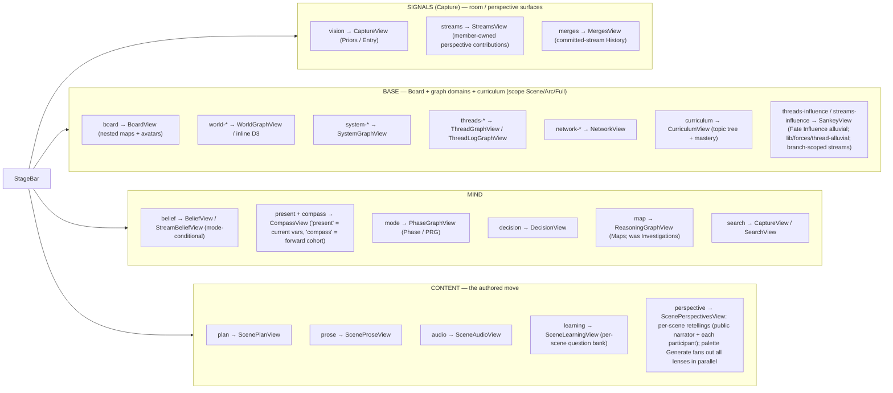

> Cluster membership lives in `StageBar` (`inSignalsMode` / `inBaseMode` / `inMindMode` / `inContentMode`). The **Signals** cluster (internally Capture) is the room/perspective workspace (`vision` Priors + `streams` + `merges`); `search` moved into **Mind**. `curriculum` joins `board` + the graph domains in **Base**. *Tab labels Signals / Base / Mind / Content; the persisted `graphViewMode` literals (`vision`, `streams`, `world-*`, …) are unchanged.* `BeliefView` swaps to `StreamBeliefView` for the member-sourced stream dashboard; `RoomUI` provides shared presentation primitives (avatars, status icons, perspective names) for Streams + Merges. The **Influence** view (`SankeyView`, threads-influence / streams-influence) reuses the shared `StagePalette` for period navigation — back/forward step one column (scene for threads, time-unit/chunk for streams) and fast-skip to the nearest populated block — bridged by `influence:nav-state` / `canvas:influence-step` window events; streams are branch-scoped with a This-branch / All-branches toggle.

Adding a view = a `GraphViewMode` literal (`types/narrative.ts`) + a `StageBar` button + a `Stage` branch (copy `mode`).

---

## 4. Right inspector (InspectorPanel tabs → bodies)

Inspector tabs are a registry inside `InspectorPanel.tsx` (separate from the center views). The `inspector` tab body is driven by `viewState.inspectorContext` via `renderInspector()`.

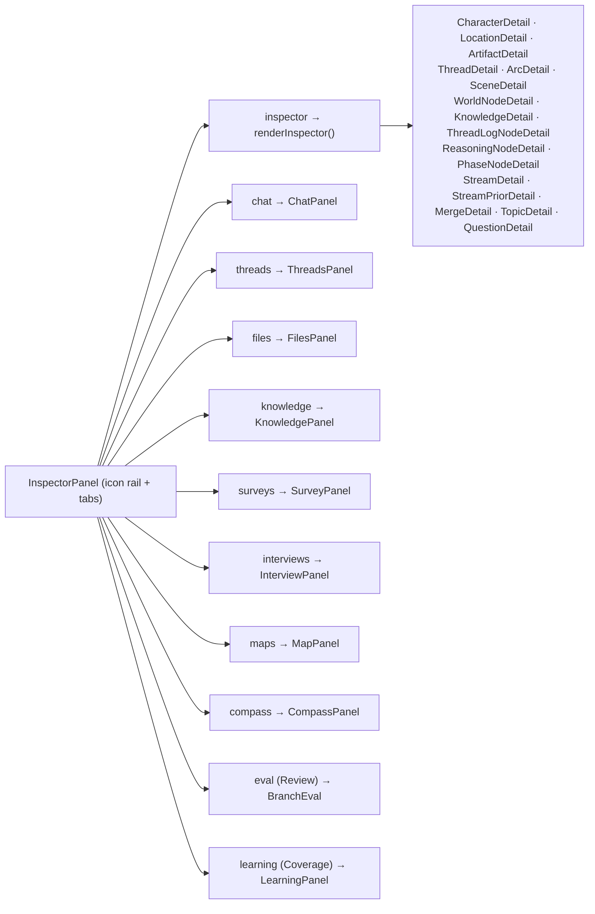

> New `renderInspector()` contexts: **stream** (`StreamDetail` — stance + priors log), **streamPrior** (`StreamPriorDetail` — one member-contributed prior), **merge** (`MergeDetail` — the war-room commit that folded a stream into continuity, linked to its arc), **topic** (`TopicDetail` — curriculum node rename/describe/re-parent), **question** (`QuestionDetail` — learning question + topic reassignment).

---

## 5. TopBar menus & modals

```mermaid
flowchart TB
    TB["TopBar"]
    TB --> SettingsMenu & View & Analyze & Profiles & Reference & Debug & Right

    SettingsMenu["Settings menu"] --> About["About → NarrativeEditModal"] & Members["Members → MembersModal"] & Agents["Agents → AgentsModal"]
    View["View menu"] --> Slides["SlidesPlayer"] & SlideRegions["SlideRegionsModal (scoped decks)"] & ThemeM["ThemeModal"] & TimeFlow["TimeFlowModal"]
    Analyze["Analyze menu"] --> GTD["GameTheoryDashboard"] & PropAn["PropositionAnalysisModal"] & ForceAn["ForceAnalytics"] & Markov["MarkovChainModal"]
    Profiles["Profiles menu"] --> Prose["ProseProfilePanel"] & Beat["BeatProfileModal"] & Patterns["PatternsModal"] & Settings["StorySettingsModal"]
    Reference["Reference menu"] --> Formula["FormulaModal"] & Defs["DefinitionsModal"]
    Debug["Debug menu"] --> ApiLogs["ApiLogsModal"] & SysLog["SystemLogModal"] & Embed["RegenerateEmbeddingsModal"]
    Right["Right controls"] --> Gas["GasMeter / UsageModal ($)"] & Audio["NowPlaying (audio)"] & Export["Export/Import packages"] & Learn["LearnModal (fullscreen quiz runner)"]
```

Two wiring conventions: open a local modal (`setXOpen(true)`), or `window.dispatchEvent(new Event('open-xxx'))` that the listening component handles. The **Learn** badge opens `LearnModal` directly; the scene **Learn** tab and the **Learning** inspector panel open it pre-scoped via `window.dispatchEvent('open-learn-modal', { detail: ScopeSelection })`. (`narrative/[id]/page.tsx` listens for the other `open-xxx` events when the panel lives at page level.)

> **Learning (Quiz) layer** — a purely additive, post-hoc surface (like game theory): per-scene MCQ question banks generated by `ai/learning` (`prompts/learning`) and aggregated/scoped by `lib/learning/quiz` (`ScopeSelection`). The three UI surfaces above all read the same banks stored per-scene on `scene.questions` (`LearningQuestion[]`); `LearnModal` runs scoped practice across them. A **Curriculum** layer (`lib/learning/curriculum`) organises the bank into a reorganisable `Topic` tree (questions assigned 1:1 to a topic), with `lib/learning/coverage` layering per-member spaced-repetition recall on top — the inspector **Coverage** tab and `CurriculumView` surface this.
>
> **Room / perspective model** — `NarrativeState` now carries the room: `Member[]` (exactly one GM, via **MembersModal** + `useActiveMember`), `Agent[]` (AI players with preset/custom personas — **AgentsModal**, `lib/agents/personas`), and `Perspective[]` (a seat bound to an entity or narrator, held by members and/or an agent). Each perspective accumulates **Streams** — a member's bearing on an open question — and committed streams fold into **Merges** that extend continuity. See Section 6.

---

## 6. Run & output surfaces (capture / generate / rehearse / review)

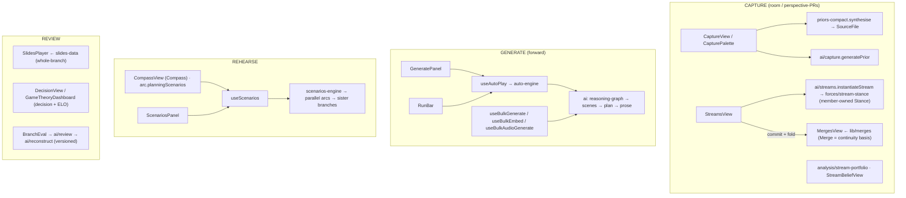

> Build status: the **room / participant model** (`Member`/`Agent`/`Perspective`), **capture-as-perspective-PRs** (Streams — a member's bearing on an open question, member-owned Stance), the **war-room merge** (Merges fold committed streams into continuity), and the **Conviction** card game ([CONCEPT.md](CONCEPT.md); §8 — Rounds variant, computer mode; the **Read → Write → Play** loop with generation calls between phases) are now **shipped**. Still **not yet built**: the weekly market, local encryption/PIN, **Signal** async capture (E2E), **Cloudflare-tunnel** (`cloudflared`) multi-user live access, and Conviction's **remote/Showdown** modes. Other shipped bases: `useScenarios`/`scenarios-engine` (Rehearse), `SlidesPlayer`/`slides-data` + **SlideRegionsModal** (scoped decks), `ai/review`+`reconstruct` (the engine's branch review). *Review-as-a-loop-phase and Butterfly were dropped.*

---

## 7. Data · AI · persistence · external (the engine pipeline)

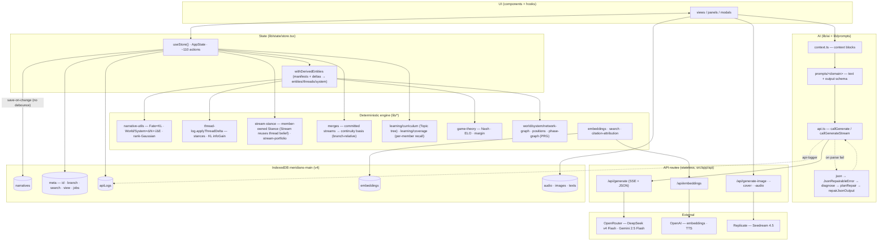

**Invariants:** one source of truth (the GM's machine); forces are *derived from deltas*, never authored; derived entities re-derive from manifests (don't mutate the caches); every LLM call funnels through `ai/api.ts` and is logged by `caller`; output schemas live with the prompt builder and are shared with repair.

> **Room / curriculum state on `NarrativeState`:** `Member[]` (one GM), `Agent[]` (AI players + personas), `Perspective[]` (entity/narrator seats), `Stream[]` (member-owned bearings on open questions — a Stream reuses Fate-Thread belief mechanics but over one member-owned Stance whose log nodes are its `priors`), `Merge[]` (committed-stream folds; **Streams + Merges are branch-OWNED** — `branchId` is ownership, and a **fork deep-copies** the parent branch's streams + merges into the child with fresh ids + an `originStreamId` / `originMergeId` back-link, so every branch is a fully isolated sandbox: priors, commits, reverts and undos on one branch never touch another, and the origin links let you compare *the same question* across divergent playthroughs. Scenes stay structurally **shared** (immutable); only the mutable belief layer is copied. `n.streams` / `n.merges` remain global dicts so id-lookups always resolve; `branchId` governs which copy a branch *operates on* and *displays*. Consumption (`basisMergeIds`) matches a copy by id **or** its origin), and `Topic[]` + `LearningProgress` (curriculum tree + per-member spaced-repetition coverage). Threads = the world view's belief over narrative questions; Streams = the parallel, perspective-scoped belief layer feeding the room.

---

## 8. Conviction — the rehearsal game state machine ([CONCEPT.md](CONCEPT.md))

A game is a **branch**; a `GameRoom` runs the turn loop over it as a phase machine (`RoundState.phase`). **Shipped: the Rounds variant in computer mode** — one GM screen, the GM proxies every seat and advances with one click. Each turn **alternates a generation call (the engine writes) with a player phase (the table acts)**, closing on the GM's confirm — the general shape is **generation → action → confirm**, and the action is the three things a player does: **READ → WRITE → PLAY**. The full loop: **(Perspective Gen) → READ → WRITE → (Stream & Intuition Gen) → PLAY → (Arc Gen) → next turn**. **Perspective Gen** writes the public account + each seat's private view; **READ** is reading that brief; **WRITE** is opening streams + adding priors (a prior that moves a thread your way *cheapens* its cards and earns conviction); **Stream & Intuition Gen** seeds the candidate streams/intuitions and **prices + deals** the cards; **PLAY** is poker turn order, committing cards; **Arc Gen** is the GM's confirm — Merge → continuation, folding the reveal window, settle and score. The live UI **auto-advances the active tab** with the phase: READ → **Perspective**, WRITE → **Write**, PLAY → **Board** (hand in the bottom dock). Scoring is **intrinsic**: each Arc Gen decomposes the realized stance shift on every thread across the seats that moved it — **Aumann–Shapley on the Fate/KL, conserving exactly** — into a running **Impact** score + **Ranking**. **Streams are perspective-owned** (one per seat — no shared "board" streams); the **Merge** is the only place separate seats' streams meet, settling each **contested thread** per **`RESOLVE_BIAS`** — who picks the winner: **`random`** (seeded draw over conviction-shaped odds) · **`highest-cost`** (the rarest action forced through) · **`realism`** (an impartial AI judge picks by what would realistically occur). A **universal realism preprocessing layer** then runs over *every* contested settlement — interpreting reality *around* the chosen winner — producing a GM-editable **telling** (what actually happens) + **reasoning** (why) + **closure** (does it settle the question) that rides onto the merge resolution: auditable, and injected into the continuation prompt as `<conflict-resolution>`. The same impartial-judge call (`ai/game-realism`, streamed reasoning) backs both the narrative merge's **Preprocess reality** step (StreamsView) and the Conviction **SHOWDOWN** review, via the shared **`RealismReview`** editor. **SHOWDOWN** sits **before Arc Gen**: tabs lock to the board, face-down cards flip, and the verdicts are revealed for the GM to veto / dictate / re-prompt before generating. *(The blind `gm` and `lowest-cost` biases were removed — realism + GM editing replaces them.)* **Goals** are optional personal trackers that never affect the score. One continuous fullscreen window, no modal chrome; the GM advances each turn through the Generate Panel (or auto-resolve auto-passes). **Deferred:** remote multi-controller play (Cloudflare tunnel) and the Showdown variant.

```mermaid
stateDiagram-v2
    [*] --> Setup
    Setup --> Turn: Start game - computer mode - GM proxies all seats

    state Turn {
        [*] --> PerspectiveGen
        PerspectiveGen --> Read: GEN - public + private views off the canon - off-clock
        Read --> Write: PLAYER reads the brief - Perspective tab
        Write --> StreamGen: PLAYER opens streams + adds priors - Write tab - WRITE clock
        StreamGen --> Play: GEN - candidate streams + intuitions seeded - cards priced + dealt
        Play --> Showdown: PLAYER commits cards in poker turn order - PLAY clock
        Showdown --> ArcGen: REVEAL all cards + realism verdicts - GM vetoes / dictates / re-prompts
        ArcGen --> PerspectiveGen: GEN - Merge + continuation - settle + score - next turn
    }
    Turn --> [*]: GM ends game - Report

    note left of Turn
      Generation calls (off-clock) alternate with player phases. phase
      ids: read = Perspective Gen + READ; write = WRITE; play = PLAY;
      showdown = the reveal; resolve = Arc Gen (folds settle + scoring).
      PerspectiveGen writes a PARALLEL BATCH of PerspectiveViews (public
      + each seat's private) off the canon; players never see canon, the
      GM sees all. StreamGen seeds each seat's candidate streams +
      intuitions, then prices and DEALS the hand.
    end note
    note right of Turn
      Streams are PERSPECTIVE-OWNED, one per seat — no shared board.
      WRITE: pose questions + add priors; a prior that moves a thread
      your way cheapens its cards (-ln p falls). PLAY: cards face
      up/down, capped at CARDS_PER_ROUND. SHOWDOWN: face-downs flip and
      a UNIVERSAL realism pass interprets each contested settlement
      (winner picked by RESOLVE_BIAS = random | highest-cost | realism),
      yielding a GM-editable telling/reasoning/closure on the merge.
      Arc Gen folds it into the continuation; SETTLE (decay->income) +
      SCORE (Aumann-Shapley Impact + Ranking). Skipped when nothing was
      committed. Chat global / location open every phase.
    end note
```

> **Build components (shipped).** Entry: **TopBar → `ConvictionModal`** — a chrome-less fullscreen window that routes by lifecycle (no room → `GameSetup`; live → `GameShell`; ended → `GameReport`).
> **Setup** — (1) **`GameSetup`**: seat the table off a searchable, prominence-sorted roster (characters · locations · artifacts), AI **Suggest cast** (`ai/game-cast`), per-seat driver (agent / member / GM), then **Rules** (resolution + WRITE/PLAY phase clocks; conviction economy under Advanced; carry-over default).
> **Live board** — (2) **`GameShell`** wraps the board + tabs + the GM dock, **auto-advances the active tab through Read → Write → Play**, surfaces the **Generate Panel at Arc Gen** (`pendingMerge` → `completeResolve`), and carries the always-visible **phase + timer bar** (GM can grant `+time`) plus the **@-mention badge**. (3) **`PokerTable`**: the felt — seats as **avatar + name + conviction stack**, rotating **dealer button**, centre pedestal (phase stepper + `PhaseTimer` + `FateOdometer` + switchable public/private view), corner **Ranking**. (4) **`SeatHand` / `ConvictionCard`**: the act-as-seat hand — face-up/down, `−ln p` cost, play / raise / fold. (5) **`GameBottomPanel`**: the GM dock — one-click **Advance** (label tracks the phase) · pause · end · clear · move. (6) **`GameSidePanels`**: the combined **Perspective** tab (public + private), the **Write** surface (streams + priors), the **Streams** ledger, this-turn **merges & settlements**, and **Chat** — a full-height messenger (global persists; location whispers are round-ephemeral; @-mentions). Agents are full participants.
> **Orchestration** — **`hooks/useConviction`** (`startGame` · `advance` · `pendingMerge` · `completeResolve` / `autoGenerateResolve` · `playCard` · `vetoPlay` · `setContestedOutcome` · `editGroupRealism` / `rerunShowdownRealism` · `openNewStream` · `move` · `actAsSeat` · `pause` / `extendClock` / `end` / `clear` · `sendChat`) threads the pure engine through the store and async generation: **`lib/game/`** (`engine` phase machine + deal · `economy` pricing/settle · `scoring` Aumann–Shapley Impact · `settlement` contested draws · `agent` deterministic auto-play fallback · `attribution` · `mentions` · `guards`) + **`lib/ai/`** (`game-narration` perspective gen · `game-streams` stream+intuition gen · `game-agent` LLM agent play · `game-conflicts` conflict detection · `game-realism` impartial-judge realism resolution · `game-cast` · `game-analysis`). The realism preprocessing UI is the shared **`components/shared/RealismReview`**.
> Types (`GameRoom` (carries `variant` · `phaseSeconds` · `autoResolve`) · `Seat` (`goals` + running `fateImpact`) · `RoundState` (`readStartedAt` · `writeStartedAt` · `playStartedAt` · `timers`) · `Card`/`Hand`/`PlayedCard` (with `priorId` + `faceUp`/`revealed`/`forcedReveal`) · `MergeResolution` (with realism `telling`/`reasoning`/`closes`) · `GameChatMessage` (`roundIndex` for ephemeral whispers) · `Goal` · `ConvictionEconomy`) layer over shipped `Perspective` / `Stream` / `Merge` / `Location` — see [CONCEPT.md](CONCEPT.md). Scoring reuses the engine's **Fate/KL + thread log**; the **Influence alluvial** (Fate tab) carries cumulative Impact.

### 8a. The interface (UI design)

**Design language — one metaphor, skinned by the app theme:** a **poker table**. The whole game is a single chrome-less fullscreen window (`ConvictionModal`); **`GameShell`** lays it out like the narrative AppShell so the two feel like one app — a left **seat rail**, a Chrome-style **tab strip**, the center **board/tab surface**, an always-on **phase + timer bar**, and a bottom **dock**. The active tab **auto-advances with the phase** (READ → Perspective, WRITE → Write, PLAY → Board); SHOWDOWN locks every tab to the board.

**Screen layout — the regions:**

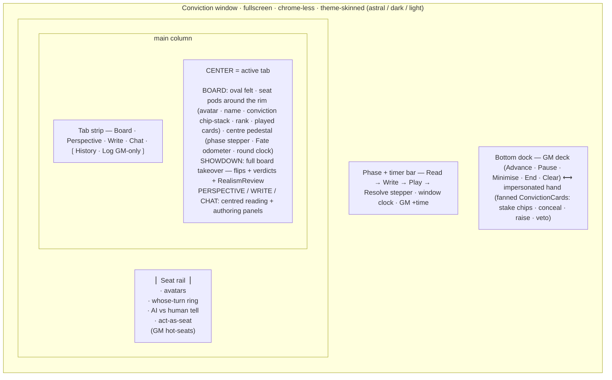

**Component tree (routing):**

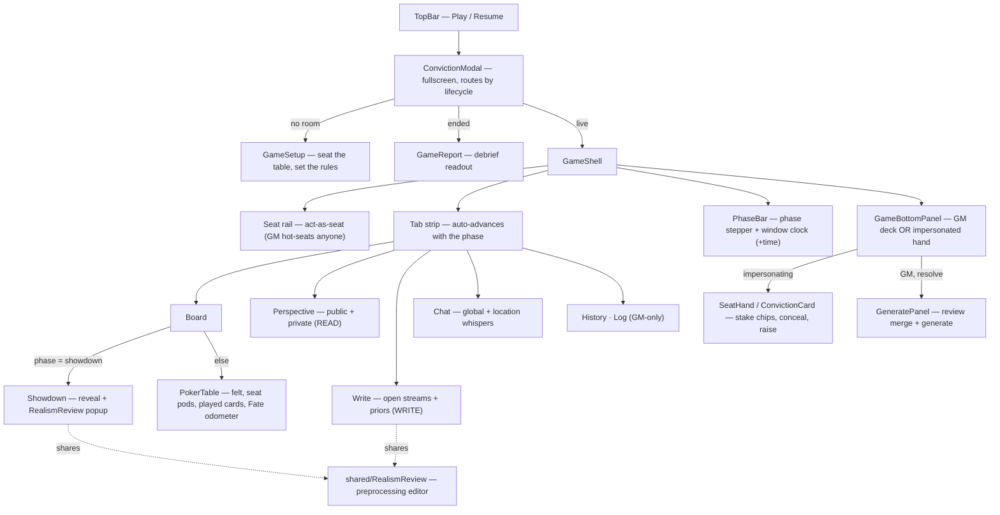

### 8b. The engine (orchestration data-flow)

**`useConviction.advance()`** is the one-click GM progression: per phase it runs the right side-effects through the pure engine + the AI calls, then commits to the store. Realism preprocessing is the load-bearing AI step — shared with the narrative merge UI.

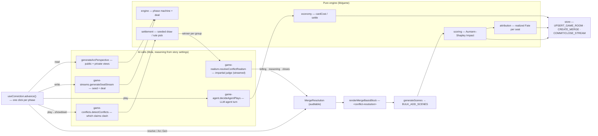
